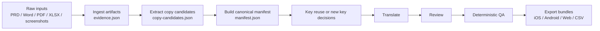
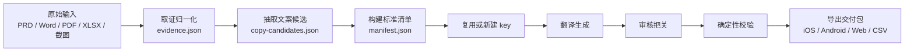

# PRD to I18n Skill

## English

No need to clean up copy first. Feed the skill your PRDs, screenshots, PDFs, and spreadsheets, and it helps turn that mess into ready-to-ship i18n delivery bundles.

This repository is now a single self-contained skill. The repo root is the skill root, so GitHub installs and zip downloads are much less confusing.

### Workflow At A Glance



### What It Handles

- Raw PRD bundles: Markdown, Word, text-based PDF, XLSX, CSV, JSON
- Visual evidence: screenshots, scanned PDFs, Figma exports
- Existing localization catalogs: iOS `.strings`, Android `strings.xml`, JSON, CSV
- Delivery outputs: manifest JSON, CSV, Web/App JSON, iOS `.strings`, Android `strings.xml`

### Repo Structure

```text
SKILL.md
agents/
assets/
references/
scripts/
```

- the repo root is the installable skill
- `assets/helper-agents/` contains optional project-level helper agent templates

### Install

Install directly from GitHub with the skill installer:

```bash
python3 ~/.codex/skills/.system/skill-installer/scripts/install-skill-from-github.py --repo jerry3413/prd-to-i18n-skill --path .
```

Or copy the whole repo root into your local skills directory:

```bash
cp -R /path/to/this-repo ~/.codex/skills/i18n-delivery-pipeline
```

Restart Codex after installing.

### Optional Helper Agents

If you want the extra coordinator, translator, and reviewer helpers as project-level agents:

```bash
mkdir -p .claude/agents
cp /path/to/this-repo/assets/helper-agents/i18n-*.md .claude/agents/
```

These templates are optional. The skill itself is designed to work without them.

### Quick Start

#### 1. Start From Raw Product Materials

If you only have a PRD bundle:

```bash
python3 scripts/ingest_artifacts.py ./prd-bundle --output /tmp/evidence.json
python3 scripts/extract_copy_candidates.py /tmp/evidence.json --output /tmp/copy-candidates.json
python3 scripts/build_manifest_stub.py /tmp/copy-candidates.json --task-mode new-build --target-locales en,zh-Hans,de --target-outputs manifest,json,ios,android --output /tmp/i18n-manifest.json
```

#### 2. Start From Existing Localization Exports

If you already exported current strings:

```bash
python3 scripts/normalize_snapshot.py --input-dir ./exports --metadata ./context.csv --output /tmp/i18n-snapshot.json
python3 scripts/build_manifest_stub.py /tmp/i18n-snapshot.json --task-mode change-sync --target-locales en,zh-Hans,de --target-outputs manifest,json,ios,android --output /tmp/i18n-manifest.json
```

#### 3. Run QA And Export

```bash
python3 scripts/qa_manifest.py /tmp/i18n-manifest.json --report /tmp/i18n-qa.json
python3 scripts/emit_delivery_bundle.py /tmp/i18n-manifest.json --out-dir /tmp/delivery-bundle
```

### How It Thinks

The workflow stays practical on purpose:

- structured text beats screenshots
- screenshots help with scene understanding, not source-of-truth text
- short ambiguous labels must ask for context
- high-risk copy stays conservative and human-gated
- one canonical manifest fans out into multiple platform formats

### Validation

Run the built-in smoke checks:

```bash
python3 scripts/run_smoke_evals.py
```

### Good Fit

This skill is a good fit if your team has any of these problems:

- product managers write copy in PRDs instead of clean spreadsheets
- translation keys are easy to duplicate and hard to find
- screenshots and design files carry important context
- review quality is inconsistent
- multiple teams need one reusable i18n workflow

---

## 中文

不用先整理文案表，直接把 PRD、截图、PDF、表格扔进来，这套 skill 会帮你把散落的文案收成能交付的多语言包。

现在这个仓库本身就是一个完整的 skill。也就是说，仓库根目录就是 skill 根目录，所以以后不管是 GitHub 安装还是手动下 zip，都会顺很多。

### 流程一览



### 这套 Skill 处理什么

- 原始 PRD 材料包：Markdown、Word、文本型 PDF、XLSX、CSV、JSON
- 视觉证据：截图、扫描版 PDF、Figma 导出
- 现有多语言资源：iOS `.strings`、Android `strings.xml`、JSON、CSV
- 交付输出：manifest JSON、CSV、Web/App JSON、iOS `.strings`、Android `strings.xml`

### 仓库结构

```text
SKILL.md
agents/
assets/
references/
scripts/
```

- 仓库根目录就是可安装的 skill
- `assets/helper-agents/` 里放的是可选的项目级 helper agent 模板

### 安装方式

直接用 skill 安装器从 GitHub 装：

```bash
python3 ~/.codex/skills/.system/skill-installer/scripts/install-skill-from-github.py --repo jerry3413/prd-to-i18n-skill --path .
```

或者直接把整个仓库根目录复制到本地 skills 目录：

```bash
cp -R /path/to/this-repo ~/.codex/skills/i18n-delivery-pipeline
```

装完后重启 Codex。

### 可选 Helper Agents

如果你还想把 coordinator、translator、reviewer 这几个辅助角色装到项目里，可以再执行：

```bash
mkdir -p .claude/agents
cp /path/to/this-repo/assets/helper-agents/i18n-*.md .claude/agents/
```

这一步不是必须的。没有它们，skill 本体也能工作。

### 快速开始

#### 1. 从原始产品材料开始

如果你手头只有 PRD、Word、PDF、表格、截图这些原始材料：

```bash
python3 scripts/ingest_artifacts.py ./prd-bundle --output /tmp/evidence.json
python3 scripts/extract_copy_candidates.py /tmp/evidence.json --output /tmp/copy-candidates.json
python3 scripts/build_manifest_stub.py /tmp/copy-candidates.json --task-mode new-build --target-locales en,zh-Hans,de --target-outputs manifest,json,ios,android --output /tmp/i18n-manifest.json
```

#### 2. 从现有多语言导出开始

如果你已经导出了当前多语言资源：

```bash
python3 scripts/normalize_snapshot.py --input-dir ./exports --metadata ./context.csv --output /tmp/i18n-snapshot.json
python3 scripts/build_manifest_stub.py /tmp/i18n-snapshot.json --task-mode change-sync --target-locales en,zh-Hans,de --target-outputs manifest,json,ios,android --output /tmp/i18n-manifest.json
```

#### 3. 跑校验并导出

```bash
python3 scripts/qa_manifest.py /tmp/i18n-manifest.json --report /tmp/i18n-qa.json
python3 scripts/emit_delivery_bundle.py /tmp/i18n-manifest.json --out-dir /tmp/delivery-bundle
```

### 它怎么工作

这套 workflow 保持“实用优先”：

- 结构化文本优先级高于截图
- 截图主要帮助理解场景，不作为默认原文真值
- 短词、歧义词必须补上下文
- 高风险文案保持保守策略，并要求人工把关
- 用一份 canonical manifest 适配多个平台输出

### 验证方式

运行内置 smoke check：

```bash
python3 scripts/run_smoke_evals.py
```

### 适合什么团队

如果你的团队有下面这些问题，这套 skill 会比较合适：

- 产品文案散落在 PRD 里，不会先整理成标准表格
- 多语言 key 很容易重复建，也不方便找
- 截图和设计稿里有很多关键上下文
- 翻译审核质量不稳定
- 多个团队都想复用同一套多语言流程
